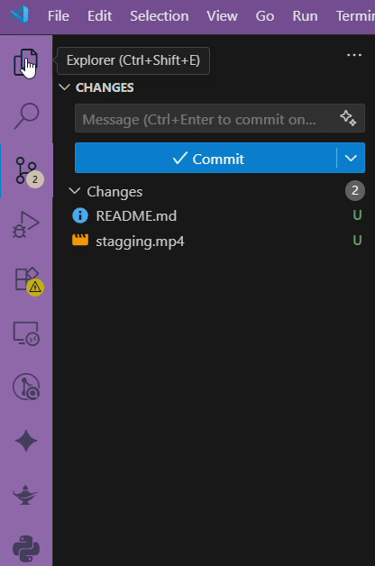
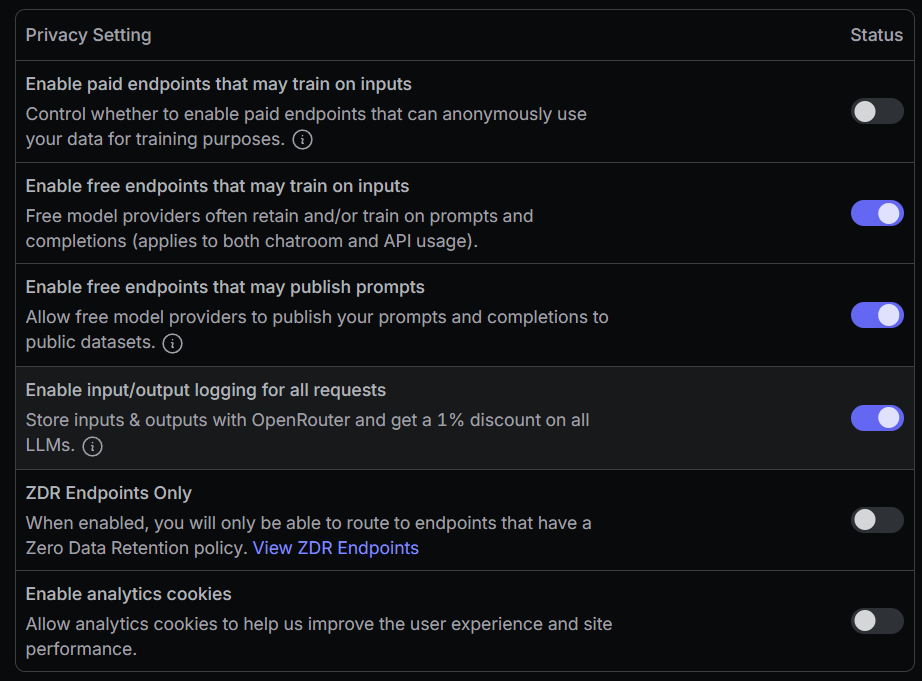

<div align="center">

#  <br/> Commit Genius - AI Git Commit Message Generator


[](https://marketplace.visualstudio.com/items?itemName=aicommit-publisher.commit-genius)
[](https://marketplace.visualstudio.com/items?itemName=aicommit-publisher.commit-genius)
[](https://open-vsx.org/extension/aicommit-publisher/commit-genius)
[](https://github.com/anmolsah/AICommit01)
[](./LICENSE)

*Transform your Git workflow with AI-generated commit messages that follow conventional commit standards*

</div>

---

## 🎯 Why Choose Commit Genius? The Ultimate AI Git Assistant

Stop wasting time writing commit messages! **Commit Genius** is the most popular AI-powered Git commit generator for VS Code, trusted by thousands of developers worldwide. Generate professional, conventional commit messages using cutting-edge AI models including OpenAI GPT, Claude, Gemini, DeepSeek, and more.

### 🏆 What Makes Us Different

- **🆓 100% Free to Start**: Use powerful free AI models with no credit card required
- **⚡ Instant Generation**: Create perfect commit messages in under 3 seconds
- **🎯 Smart Staging**: Automatically stages your changes - no manual work needed
- **📊 Conventional Standards**: Follows industry-standard commit conventions (feat, fix, chore, etc.)
- **🔒 Enterprise Security**: Your code never leaves your machine - only diffs are analyzed

### ✨ Key Benefits That Developers Love

- **⚡ Lightning Fast**: Generate commit messages in under 3 seconds
- **🤖 Multiple AI Models**: OpenAI GPT, Claude Sonnet, Google Gemini, DeepSeek, Mistral, Qwen
- **📏 Conventional Commits**: Perfect `feat:`, `fix:`, `chore:`, `docs:` formatting every time
- **🆓 Free Forever**: Start with powerful free models, upgrade when you need more
- **🔒 Bank-Level Security**: API keys encrypted in VS Code's secure storage
- **🎨 Zero Setup**: Works instantly with your existing Git workflow
- **📈 Productivity Boost**: Save 5+ minutes per commit, focus on coding instead

---

## Features

### 🤖 AI-Powered Generation

- Generate commit messages using state-of-the-art AI models
- Support for both **free** and **premium** AI models
- Intelligent analysis of your staged changes

### 📋 Conventional Commits

- Automatically formats messages with proper prefixes (`feat:`, `fix:`, `chore:`, etc...)
- Maintains consistent commit history
- Improves project maintainability and readability

### 🛠️ Developer Experience

- One-click generation via sparkle button in Source Control
- Seamless VS Code integration
- Edit generated messages before committing
- Secure API key management

### 🌐 Model Flexibility

- **Free Models**: DeepSeek, Qwen, Mistral, OpenAI GPT-OSS
- **Premium Models**: Claude Sonnet 4, Gemini 2.5 Pro, Grok Code Fast
- Easy model switching through VS Code settings

---

## Demo Videos

### ✨ Sparkle Button in Action

<div align="center">



*Click the sparkle button in Source Control to generate AI commit messages*

</div>

---

## 📦 Installation - Get Started in 30 Seconds

### Method 1: VS Code Marketplace (Recommended)

1. Open **Visual Studio Code**
2. Press `Ctrl+Shift+X` (Windows/Linux) or `Cmd+Shift+X` (Mac) to open Extensions
3. Search for **"Commit Genius"** or **"AI Git Commit"**
4. Click **Install** on the extension by `aicommit-publisher`
5. Reload VS Code if prompted

### Method 2: Command Line Installation

```bash
code --install-extension aicommit-publisher.commit-genius
```

### Method 3: Direct Download

- Download the latest `.vsix` file from [GitHub Releases](https://github.com/anmolsah/AICommit01/releases)
- Install via `Extensions: Install from VSIX` command in VS Code

### ✅ Verify Installation

Look for the ✨ sparkle button in your Source Control panel - you're ready to go!

---

## Quick Start Guide

### Step 1: Get Your API Key

1. Visit [OpenRouter.ai](https://openrouter.ai/keys)
2. Sign in with GitHub or Google
3. Click **"Create Key"**
4. Copy your API key (starts with `sk-or-...`)

### Step 2: Configure Commit Genius

1. Make some changes in your Git repository
2. Click the **✨ sparkle button** in the Source Control panel (staging happens automatically)
3. Paste your API key when prompted
4. Watch as your commit message is generated!

### Step 3: Customize (Optional)

- Go to **Settings** → **Extensions** → **Commit Genius**
- Choose your preferred AI model
- Adjust settings to match your workflow

---

## Configuration

### Available Models

#### 🆓 Free Models

| Model | Provider | Description |
|-------|----------|-------------|
| `deepseek/deepseek-chat-v3-0324:free` | DeepSeek | Advanced coding model (71B parameters) |
| `qwen/qwen3-coder:free` | Qwen | Specialized code understanding |
| `mistralai/mistral-small-3.2-24b-instruct:free` | Mistral | Balanced performance and speed |
| `openai/gpt-oss-120b:free` | OpenAI | Large context understanding |
| `moonshotai/kimi-k2:free` | MoonshotAI | Optimized for agentic capabilities |

#### 💎 Premium Models

| Model | Provider | Description |
|-------|----------|-------------|
| `anthropic/claude-sonnet-4` | Anthropic | Superior reasoning and code analysis |
| `google/gemini-2.5-pro` | Google | Advanced multimodal capabilities |
| `x-ai/grok-code-fast-1` | X.AI | Fast and efficient code generation |
| `deepseek/deepseek-chat-v3.1` | DeepSeek | Enhanced version with better accuracy |

### Settings Configuration

```json
{
  "commit-genius.model": "moonshotai/kimi-k2:free"
}
```

---

## Usage Tips

### 🎯 Best Practices

- **Keep changes focused**: Make focused, related changes for more accurate commit messages
- **Review before committing**: Always review the generated message and edit if needed
- **Use descriptive file names**: Better file names lead to better commit messages
- **Commit frequently**: Smaller, focused commits generate better messages

### Troubleshooting

---

##  Troubleshooting API Issues

### ❌ Problem: API Error (404) with Free Models

If you see an error like:


This happens because most **free models on OpenRouter do not support Zero Data Retention (ZDR)**.  
When ZDR is enabled, free endpoints are filtered out, which causes the 404 error.

---

###  Fix: Update OpenRouter Privacy Settings

1. Go to [OpenRouter Privacy Settings](https://openrouter.ai/settings/privacy).
2. Under **Training, Logging & Privacy**, configure your settings as shown below:
   - Enable **Free endpoints that may train on inputs** ✅
   - Enable **Free endpoints that may publish prompts** ✅
   - Enable **Input/output logging for all requests** ✅
   - Disable **ZDR Endpoints Only** ❌ (turn this off if you want to use free models)

 Example configuration:



---

### ℹ️ Notes

- If you **require ZDR for compliance**, you’ll need to use **paid models** (e.g., Claude, GPT-4 Turbo, Gemini Pro) because free models don’t support ZDR.
- For most personal projects, the above settings will allow free models to work smoothly.

---


#### Rate Limits

- Free models have usage limits
- If you hit a rate limit, wait a few minutes or switch to a other free models or premium models
- Consider upgrading to premium models for heavy usage

#### API Key Issues

- Ensure your API key starts with `sk-or-`
- Check that your OpenRouter account has sufficient credits if using paid model or continue with free models
- Re-enter your API key if authentication fails

#### Git Repository

- Ensure you're in a valid Git repository
- Make sure you have changes in your working directory (staging happens automatically)
- Check that Git is properly installed and configured

---

## Example Output

### Input: Staged Changes

```diff
+ Added user authentication middleware
+ Updated package.json version
- Removed deprecated API endpoints
```

### Output: Generated Commit Message

```
feat: add user authentication middleware and update package version
```

### More Examples

| Change Type | Generated Message |
|-------------|-------------------|
| Bug fix | `fix: resolve null pointer exception in user service` |
| New feature | `feat: implement dark mode toggle functionality` |
| Documentation | `docs: update API documentation with new endpoints` |
| Refactoring | `refactor: optimize database query performance` |
| Dependencies | `chore: update dependencies to latest versions` |

---

## Security & Privacy

### 🛡️ Data Protection

- **Local Storage**: API keys are stored securely in VS Code's encrypted secret storage
- **No Data Collection**: We don't collect or store your code or commit messages
- **Secure Transmission**: All API requests use HTTPS encryption
- **No Telemetry**: No usage data is sent to external servers

### 🔐 API Key Security

- Keys are never logged or exposed in plain text
- Stored using VS Code's built-in secret management
- Only transmitted to OpenRouter.ai for API requests
- Can be updated or removed at any time

---

## License

This project is licensed under the MIT License - see the [LICENSE](./LICENSE) file for details.

---

## Support

### ⭐ Show Your Support

If you find Commit Genius helpful, please:

- ⭐ Star the repository on [GitHub](https://github.com/anmolsah/AICommit01)
- 📝 Leave a review on the [VS Code Marketplace](https://marketplace.visualstudio.com/items?itemName=aicommit-publisher.commit-genius)

---

## 🔍 Frequently Asked Questions (FAQ)

### Q: Is Commit Genius really free?

**A:** Yes! We offer powerful free AI models including DeepSeek, Qwen, Mistral, and OpenAI GPT-OSS. Premium models are available for advanced users.

### Q: How does it compare to GitHub Copilot?

**A:** Commit Genius specializes in commit messages with conventional commit standards, while Copilot focuses on code completion. They work great together!

### Q: What AI models are supported?

**A:** We support 15+ models including OpenAI GPT, Claude Sonnet 4, Google Gemini 2.5 Pro, DeepSeek, Mistral, Qwen, and more via OpenRouter.ai.


## 🏷️ Tags & Keywords
`git commit` `ai commit message` `conventional commits` `vs code extension` `openai` `claude` `gemini` `source control` `git automation` `commit generator` `ai assistant` `developer productivity` `git workflow` `semantic commits` `commit standards` `version control` `scm` `artificial intelligence` `machine learning` `deepseek` `mistral` `qwen` `openrouter`

---

<div align="center">

**Made with ❤️ by Anmol**

[🏠 Homepage](https://github.com/anmolsah/AICommit01) • [📦 VS Code Marketplace](https://marketplace.visualstudio.com/items?itemName=aicommit-publisher.commit-genius) • [⭐ GitHub](https://github.com/anmolsah/AICommit01) • [📧 Support](https://github.com/anmolsah/AICommit01/issues)

### 🚀 More AI Tools for Developers

Looking for more AI-powered development tools? Check out our other extensions and follow us for updates!

</div>
